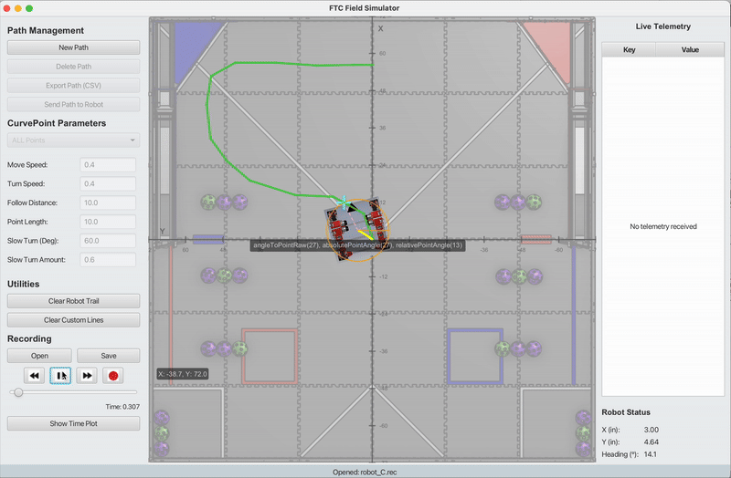
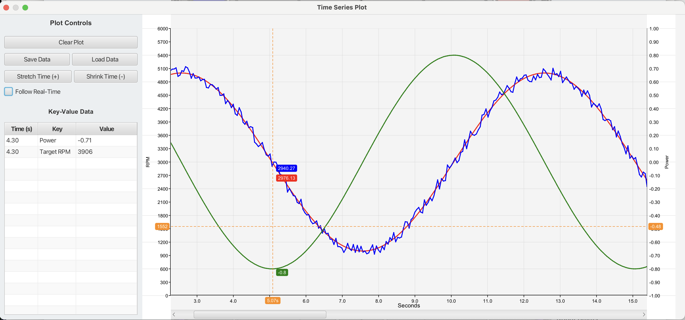

# FTC Field Simulator & Live Plotter

Welcome to the FTC Field Simulator! This tool is designed to help you visualize your robot's position on the field and graph its sensor data in real-time, making debugging faster and more intuitive.

This guide will focus on how to send data from your FTC robot code to the simulator.

## Features

*   **Live Field Visualization:** See your robot's calculated position (odometry) move on a 2D field.
*   **Real-time Data Plotting:** Graph any data from your robot—like motor RPM, sensor values, or current draw—on a live, scrolling chart.
*   **Dual-Axis Plotting:** Display two different types of data on the same chart with independent scales (e.g., RPM on the left, Amps on the right).
*   **Simple UDP Integration:** Just add a couple of Java files to your robot project to get started.

## Screenshots

#### Main Simulator View

This view shows your robot's position on the field, along with a live table of key-value data you send from the robot.



#### Live Data Plotter

The plotter window graphs data over time. In this example, it shows flywheel RPM (left axis) and motor current (right axis).



## How It Works: A Simple Diagram

Your robot code sends small messages (UDP packets) over the Wi-Fi network to the simulator running on your computer. The simulator listens for these messages and updates the display accordingly.

```text
+---------------------------------+      +-----------------------------------------+
|                                 |      |                                         |
|      FTC Robot Controller       |      |          Your Computer                  |
|                                 |      |                                         |
|  +---------------------------+  |      |  +------------------------------------+ |
|  |       Your OpMode         |  |      |  |         FTCFieldSimulator          | |
|  |                           |  |      |  |                                    | |
|  |  // Robot moves...        |  |      |  |  +--------------+  +-------------+ | |
|  |  Pose2D pos = odo.get();  |  |      |  |  |              |  |             | | |
|  |                           |  |      |  |  |  Field View  |  |   Plotter   | | |
|  +---------------------------+  |      |  |  |              |  |             | | |
|        |                |       |      |  |  +--------------+  +-------------+ | |
+--------|----------------|-------+      |  |         ^                ^         | |
         |                |              |  +---------|----------------|---------+ |
         |                |              |            |                |           |
      UDP Messages over Wi-Fi            |            |                |           |
         |                |              +-----------------------------------------+
         |                |                           |                |
         +--------------------------------------------+                |
    "POS 12.3 45.6 90.0"  |                                            |
  (Field Position Update) |                                            |
                          |                                            |
                          +--------------------------------------------+
                                     "LINE 166... 5021.5 2"  "LINE2 166... 1.25 3"
                                     (Plot RPM on Left Axis) (Plot Amps on Right Axis)
```
## How to Use It

You only need to interact with two main classes in your robot's `teamcode` folder: `UdpClientFieldSim.java` and `UdpClientPlot.java`.

### 1. `UdpClientFieldSim` - Visualizing Robot Position

This class is for sending your robot's (X, Y, Heading) position to the 2D field view.

#### Quickstart

In your `TeleOp` or `Autonomous` OpMode:
 
1. **Declare the client:**

```java
// At the top of your OpMode class 
UdpClientFieldSim fieldSimClient;
```

2. **Initialize it in `init()`:**

```java
// In your init() method // Replace with your computer's IP address
fieldSimClient = new UdpClientFieldSim("192.168.43.100", 7777);
```

3. **Send data in `loop()`:**

```java
// In your loop(), after you update your odometry
Pose2D currentPose = odometry.getPosition();
if (fieldSimClient != null && fieldSimClient.isInitialized()) { 
// Send the robot's position 
fieldSimClient.sendPosition( currentPose.getX(DistanceUnit.INCH), currentPose.getY(DistanceUnit.INCH), currentPose.getHeading(AngleUnit.DEGREES) ); 
// You can also send key-value pairs to the data table 
fieldSimClient.sendKeyValue("Flywheel RPM", flywheel.getCurrentRPM()); 
fieldSimClient.sendKeyValue("Intake Status", "ON"); }
```

4. **Close it in `stop()`:**

```java
// In your stop() method to clean up 
if (fieldSimClient != null) { fieldSimClient.close(); }
```

### 2. `UdpClientPlot` - Graphing Live Data

This class is for sending numerical data to the plotter. You can create separate instances for different subsystems (like `FlyWheel` or `BallColor`) to keep your code organized.

#### Quickstart

Imagine you have a `FlyWheel.java` class and you want to debug its RPM and motor current.

1. **Declare the plotter client inside your subsystem class:**

```java
    // Inside your FlyWheel.java class
    private UdpClientPlot plotClient;
    private boolean isDebugEnabled = false;
    private String plotClientHost = "192.168.43.100"; // Your computer's IP
    private int plotClientPort = 7778; // The port the plotter is listening on
```
2. **Create a method to turn debugging on/off:**

This is the best practice! It lets you enable plotting from your main Robot.java file only when you need it.

```java
// Inside your FlyWheel.java 
class public void setDebug(boolean enable) {
    if (enable && !isDebugEnabled) { 
        this.isDebugEnabled = true; 
        plotClient = new UdpClientPlot(plotClientHost, plotClientPort); 
        // --- Configure the graph axes --- 
        if (plotClient.isInitialized()) { 
            long time = System.currentTimeMillis(); 
            // Configure the LEFT axis for RPM 
            plotClient.sendYUnits(time, "RPMs"); 
            plotClient.sendYLimits(time + 1, 6500, 0); // Max RPM, Min RPM 
            // Configure the RIGHT axis for Amps 
            plotClient.sendYUnits2(time + 2, "Amps"); 
            plotClient.sendYLimits2(time + 3, 2.0, 0.0); // Max Amps, Min Amps
        }
    } else if (!enable && isDebugEnabled) { 
        this.isDebugEnabled = false; close(); 
        // Clean up resources 
    }
}
```

3. **Send data from your `update()` method:**

```java
// Inside the update() method of FlyWheel.java
if (isDebugEnabled && plotClient != null) { 
    long time = System.currentTimeMillis(); 
    // Plot Target RPM (blue line, style 1) on the LEFT axis 
    plotClient.sendLineY(time, getTargetRPM(), 1); 
    // Plot Current RPM (red line, style 2) on the LEFT axis 
    plotClient.sendLineY(time, getCurrentRPM(), 2); 
    // Plot Motor Current (green line, style 3) on the RIGHT axis 
    double amps = motor1.getCurrent(CurrentUnit.AMPS); 
    plotClient.sendLineY2(time, amps, 3); // Note the '2' for the right axis! 
}
```
4. **Add a `close()` method:**

```java
// Inside your FlyWheel.java
class public void close() {
    if (plotClient != null) { 
        plotClient.close(); 
        plotClient = null; 
    } 
    this.isDebugEnabled = false; 
}
```

#### Available UdpClientPlot Functions
- Left Axis (Y1):
  - sendLineY(time, value, style): Adds a point to a line graph.
  - sendYLimits(time, max, min): Sets the scale.
  - sendYUnits(time, "Label"): Sets the axis title.
- Right Axis (Y2):
  - sendLineY2(time, value, style): Adds a point to a line graph on the right axis.
  - sendYLimits2(time, max, min): Sets the scale for the right axis.
  - sendYUnits2(time, "Label"): Sets the title for the right axis.
- General:
  - sendKeyValue(time, "Key", "Value"): Shows data in the text table.
  - sendTextMarker(time, "Event Name", "top" | "mid" | "bot"): Draws a vertical line with a label on the graph to mark an event.